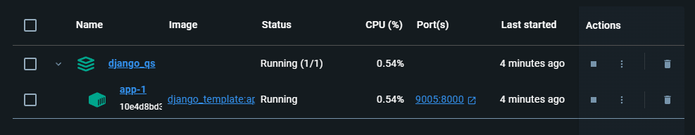
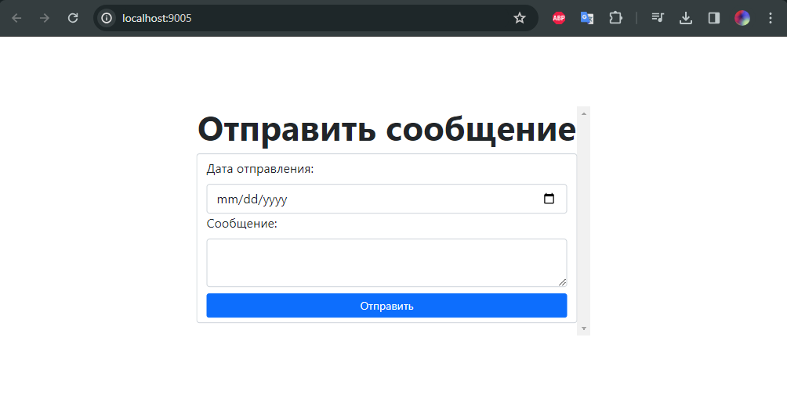
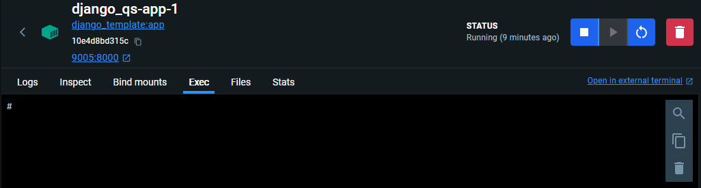
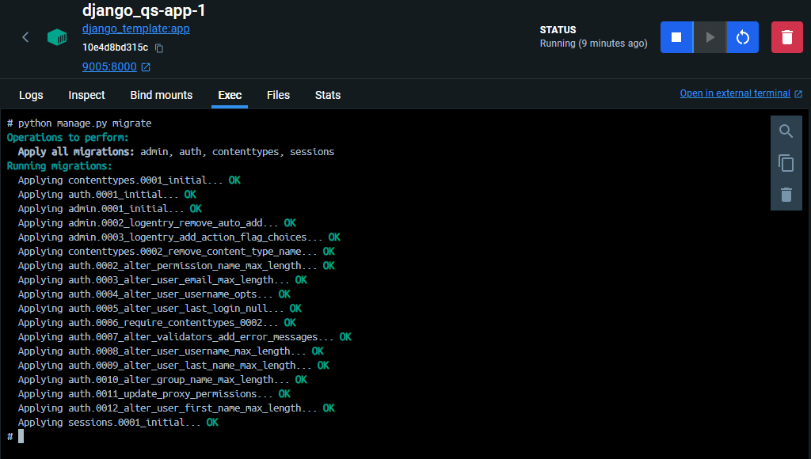
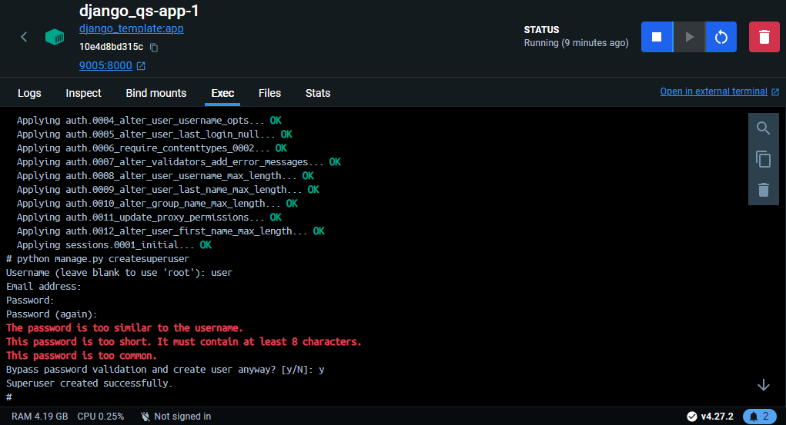
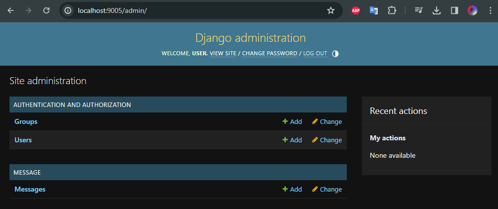

# Как развернуть приложение?
1. Установите Docker Desktop
2. Скопируйте этот проект с помощью команды: `git clone https://github.com/ArtemKinko/django-quick-start`
3. В корневой папке проекта запустите команду: `docker-compose -p django_qs up -d`
4. После сборки, установки зависимостей и т.п., Вы увидите сообщение: `✔ Container django_qs-app-1  Started`. После этого переходите в Docker Desktop, во вкладку контейнеров. Результат должен быть похожим: 
5. В столбце "Port(s)" указаны порты, на которых развернут сервер. При нажатии на ссылку откроется вкладка браузера с приложением: 
6. Далее нажмите на название контейнера: "app-1" и перейдите во вкладку "Exec": 
7. Пропишите в консоли: `python manage.py migrate` - это нужно для создания базы данных по моделям данных, которые определены в приложении. Результат должен быть таким: 
8. Тут же пропишите `python manage.py createsuperuser` для создания Вашего пользователя. Следуйте простым инструкциям и получите схожий результат: 
9. Приложение развернуто и готово к использованию!

# Какие страницы используются в приложении?

- Перейдите на корневую страницу для добавления сообщения: http://localhost:9005/
- Для доступа к панели администратора перейдите сюда: http://localhost:9005/admin/ (вводите тот логин и пароль, который указывали при создании суперпользователя)
- Как заглушка для показа возможностей редиректа используется страница: http://localhost:9005/message_view

# Как использовать приложение?
1. На главной странице Вы можете ввести любую дату и сообщение, которые добавятся в БД при нажатии на кнопку "Отправить".
2. В панели администратора можно управлять записями в базе данных. Так, Вы увидите соответствующую строку в панели: "Messages", при нажатии на которую Вы сможете просмотреть содержимое таблицы: 
3. Для перехода к определенному объекту нажмите на строку "Message object (\<i\>)", где i - id сообщения.

# Как собирается приложение?
> Контейнер в докере - отдельная среда со своей ОС, установленными библиотеками и возможностями. Контейнер изолирован от остального мира и использует (если работать с докером правильно) **Volumes** - общие с другими приложениями и контейнерами ресурсы.

Для сборки и запуска контейнеров используется файл `docker-compose.yml`. Пройдемся по командам в его содержании:
- `version` - версия compose-спецификации, используемой для разметки файла;
- `services` - ключевое слово, после которого указываются микросервисы с их конфигурациями;
- `app` - название микросервиса;
- `image` - образ, используемый для его создания;
- `build` - раздел, где указываются особенности сборки проекта;
- `context` - устанавливает корневой каталог, относительно которого будут выполняться все команды пути;
- `env-file` - путь к файлу `.env` - файла с переменными среды для конкретного контейнера;
- `restart` - флаг, указывающий, будет ли контейнер перезапускаться при критической ошибке;
- `stdin_open` - флаг, подключающий терминал к контейнеру;
- Используется для указания команд терминала, которые будут выполнены при каждом запуске контейнера. В данном случае - команда для запуска сервера.
```yaml
    command: >
      sh -c "
            python manage.py runserver 0.0.0.0:8000
      "
```
- `ports` - порты, на которых открыт контейнер;
- `tty` - флаг, выделить ли псевдотерминал для связи контейнера с внешним миром;
- `volumes` - указывает на общие файлы для контейнера.

# Как собирается микросервис?
> Для каждого микросервиса должен быть предусмотрен файл `Dockerfile`, в котором будут прописаны команды, выполняемые при сборке. Так как изначально контейнер создается пустым (на самом деле, там есть системные файлы; пользовательские файлы нужно поместить туда руками), наиболее частой командой в `Dockerfile` является команда копирования директории. Рассмотрим файл, используемый для разворачивания нашего микросервиса.

- `FROM` - шаблон приложения, которое будет использовано.
- `ENV` - определяет переменную среды (также вместо этого можно вписать ее в файл `.env`)
- Копирует файлы из проекта в контейнер, а также устанавливает зависимости, указанные в `requirements.txt`. **В этот файл вы ОБЯЗАНЫ написать все зависимости, используемые в проекте**
```Dockerfile
RUN mkdir "/django_app"
COPY ./django_app /django_app
RUN pip install -r /django_app/requirements.txt
```
- `WORKDIR` - устанавливает рабочую директорию для контейнера (все команды будут выполняться из этого места)

# Как выглядит структура Django-приложения?

## Настройки Django

Все настройки лежат в файле `settings.py`. Самые важные из них:
- `INSTALLED_APPS` - используемые приложения (сюда включаются внешние приложения, а также приложения, описывающие модели даннных).
- `TEMPLATES` - определяет директории для шаблонов HTML, которые будут использованы для отрисовки страниц (устанавливает корневой каталог).

## URL страниц
Для указания страниц, на которой будет что-то отображаться, используется файл `urls.py`. В список можно добавить свои отображения (Views), которые будут отрисовывать страницу и обрабатывать ввод на них.
Для этого в список urlpatterns добавьте объект path, где первый параметр будет относительным путем до страницы, второй - классовый метод `as_view()` вашего класса, наследующего встроенный класс `View`.

## Модели данных
Для указания использованных моделей данных используется наследование класса от `django.db.models.Model`.
Для создания полей используются классы, также определенные в `django.db.models`. Так, рассмотрим класс `Message`:

- `dt_upload` - поле формата DateTime, в котором можно хранить дату и время;
- `text` - поле формата TextField, текстовое поле.

Данные объекты будут автоматически подвязаны под схему БД. Для того чтобы Django понял это, необходимо создать приложение (app), в котором указать название таблицы. Как пример, в проекте создан `message_app.py`.

## Формы из моделей данных
Django предоставляет простой инструмент для преобразования Python-кода к HTML-форме. Для этого используется библиотека `django.forms`. Так, в ней определены все типы для \<input\> в HTML форме. Обратимся к `message-form.py`:

Для применения преобразования **обязательно** наследуйте свой класс от `ModelForm`.
- `dt_upload_element` - объект класса `DateField` - соответствует HTML-тегу \<input type="datetime-local"\>
- `text_element` - объект класса `CharField` - соответствует HTML-тегу \<input type="text"\>

Для указания связи формы и модели используется класс `Meta`, в котором указывается класс модели и названия его полей. Для получения от формы "очищенных" от тегов данных используется метод `clean`.

## Отображение формы на странице
Для отображения страницы используется библиотека `django.views.generic`, в частности, для представления формы - `FormView`. Рассмотрим на примере `message_view.py`:

- `form_class` - класс, который будет использован для отрисовки страницы;
- `template_name` - название HTML-файла (шаблона), который будет отображен на странице браузера;
- `success_url` - путь до следующей страницы, используемой при корректной отправки формы.
- метод `form_valid` вызывается, когда форма `form` корректно заполнена и отправлена нажатием на кнопку \<input type="submit"\>. Здесь вызывается метод `form.save()`, который автоматически вызывает метод очистки формы и сохраняет объект в БД.

## Шаблоны HTML

По сути, представляют собой обычный HTML, в который можно добавлять элементы программирования с помощью команд, указанных в {{фигурных скобках}}. Так, в `message_form_view.html` указывается использование Boostrap5, а также названия для некоторых полей. Для этого используется, так называемый, контекст, по механизму похожий на Headers в HTML и REST-запросы. Так, тут для текстового поля дается название, определенное в Python-форме и переданное через контекст. Больше о такой разметке ищите по запросу "Django Template".